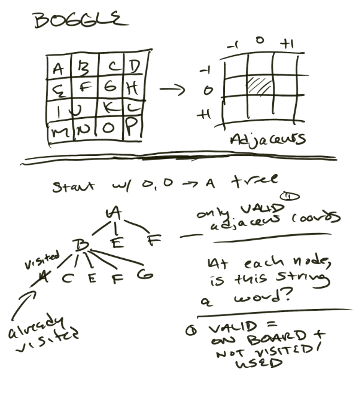

### Boggle Rules 

(I had to google this)
- The goal of the game is to find as many words as possible in the 4x4 grid of letters.
- Words are formed by connecting adjacent letters (including diagonals) in any direction, without using any single letter cell more than once.
- Words must be at least three letters long.
- QU counts as two letters
- full credit for singular and plural of a word (i.e. OIL and OILS)



### How to solve a 4x4 Boggle Board
- create 4x4 board
- start at point 0,0 as the root
- get a list of "next" adjacent cubes
- set those as the children of the current cube root in tree structure
- perform a DFS on the children
- if a word is found, add it to the list of words (should be no dupes)
- if we reach a dead end, backtrack to the previous point and continue the DFS
- once we have exhausted all possible paths, return the list of words


### test

```console
curl -X POST -H "Content-Type: application/json" -d '{"matrix": [["a", "b", "c", "d"], ["e", "f", "g", "h"], ["i", "j", "k", "l"], ["m", "n", "o", "p"]]}' http://localhost:8080/boggle
```